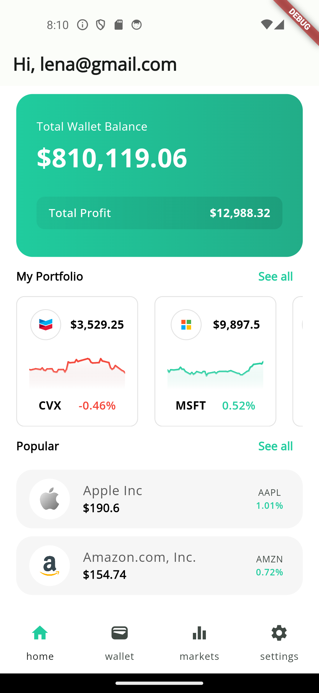
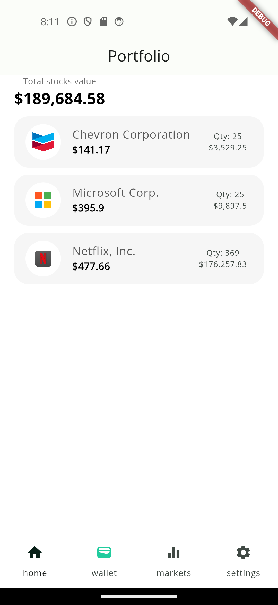
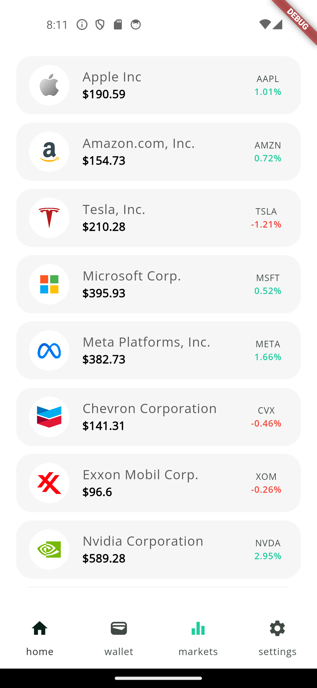

# mock-market description

A live-data stock-market app with real-time connections to APIs using a websocket server. As this is a school project, we've included the video of the audit process that showcases main features of the app: https://www.youtube.com/watch?v=pr5fL9-fStg

## Features

- Each new user has a starting balance of $1,000,000 (fake dollars)
- Track prices for 20 stocks in real time
- See historical data for a single stock
- Buy/sell/hold stocks

# Technologies

**Backend**:

- Firebase Authentication
- Firestore: [Firebase](https://firebase.google.com/)
- API with real-time data: - https://finnhub.io
- API with historical data: - https://iexcloud.io

**Frontend**:

- Flutter
- State management with Provider pattern: - https://docs.flutter.dev/data-and-backend/state-mgmt/simple

# True Nerd Quest: Run Project Locally

- Proceed to the official [Flutter documentation](https://docs.flutter.dev/get-started/install), be ready to get your socks knocked off!
- Clone this repo to your machine.
- Run `flutter pub get`
- Get free API key from [FinnHub](https://finnhub.io) for real-time data fetching
- Get free API key from [IEX Cloud](https://iexcloud.io) for historical data retrieving
- Create `.env` file in root directory of the app and create variables for API kyes (see `.env.example`)
- Run `main.dart` file with debugger (`ctrl+F5` in VSCode)
- Enjoy the app, go treat yourself to stocks you've never had the money for.

## Attributions

[IEX Cloud](https://iexcloud.io),
[FinnHub](https://finnhub.io),
Project design inspiration [Dribbble](https://dribbble.com/shots/16777094-Stock-Market-Mobile-App)
Stock icons [icons8](https://icons8.com/)

## Important note

This app has no commercial use! Authors are not getting any revenue from this project!

## Screenshots

